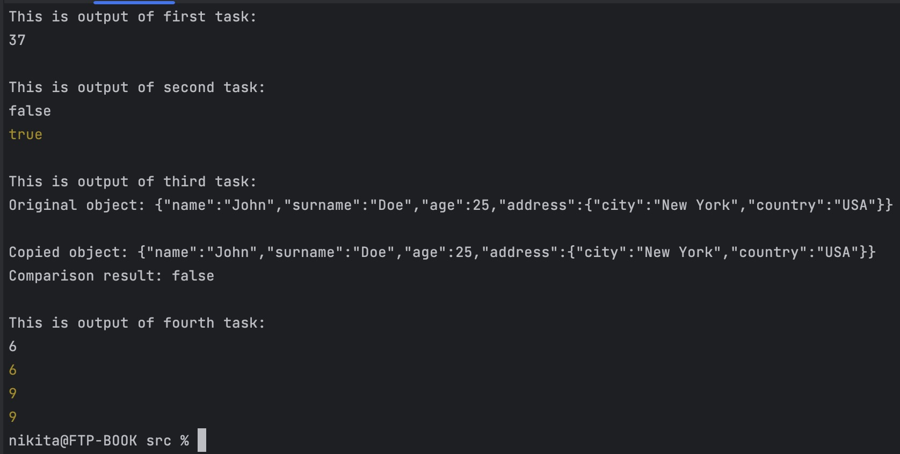

# Documentation for the second lab work

I decided to write a lab work using the principles of OOP.

## Class: Adder
The Adder class is a simple implementation of a numerical adder. It has a private property sum, which keeps track of the current sum of numbers. The constructor initializes the sum property to zero.

The class has a single public method add, which takes a number y as an argument. If the argument y is undefined, the method returns the current value of sum. Otherwise, it adds y to sum, and returns a reference to the add method (using the bind method) so that it can be chained with additional calls to add.

### Here is an example usage of the Adder class:

    const adder = new Adder();
    adder.add(2)(5)(7)(1)(6)(5)(11)(); // 37

Overall, the Adder class is a simple yet powerful implementation of an adder that allows for chaining multiple additions together.

## Class: AnagramChecker

The AnagramChecker class is a TypeScript class that checks whether two given strings are anagrams or not. It has the following properties and methods:

Properties
str1: a private property of type string, which holds the first string to be checked for anagram.
str2: a private property of type string, which holds the second string to be checked for anagram.
Constructor
constructor(str1: string, str2: string): creates an instance of the AnagramChecker class with the given two strings. It initializes the str1 and str2 properties of the instance.
Methods
isAnagram(): boolean: a public method that returns a boolean indicating whether the two strings are anagrams or not. It checks if the two strings have the same length after removing non-alphanumeric characters and converting to lowercase. It then sorts the characters in both strings and compares them. If the sorted strings match, the method returns true, otherwise it returns false.
### Example Usage

    const ac_1 = new AnagramChecker("debit card", "bad credit");
    const isAnagram = ac.isAnagram(); // true

    const ac_2 = new AC('Hello', 'oleeh');
    const isAnagram = ac.isAnagram(); // false

## Class: ObjectCopier

This is a generic class that provides a deep copy functionality for an object of a given type `T`.

### Constructors

`constructor(originalObject: T)`

This creates an instance of the ObjectCopier class with a given object of type T as the original object to be copied.

### Parameters:

originalObject - An object of type `T` that needs to be copied.
### Methods

`deepCopy(): T`
This method returns a deep copy of the original object provided to the constructor. It iterates through all the properties of the original object and copies each property to a new object. If the property is an object, the method recursively creates a new `ObjectCopier` instance to copy that object as well. This results in a new object that is a deep copy of the original object.

### Returns:

Returns a new object of type `T` that is a deep copy of the original object.
### Example Usage:

    const person = {
    name: 'John',
    surname: 'Doe',
    age: 25,
    address: {
        city: 'New York',
        country: 'USA'
        }
    };
    
    const copier = new ObjectCopier(person);
    const copy = copier.deepCopy();

## Class: FunctionCache

The FunctionCache class is a wrapper class that can be used to cache the result of any function with an arbitrary number of parameters. The class is implemented using TypeScript and adheres to OOP principles.

### Constructor

`constructor(fn: (...args: T) => R)`

The constructor of the FunctionCache class takes a function as its parameter, which is the function that is to be cached. The function signature must match the type `(...args: T) => R`, where `T` is an array of unknown arguments and `R` is the return type of the function.

### Properties
`cache: Map<string, R>`

This property is a Map object that is used to store the cached results of the function calls. The key of the map is a string representation of the function arguments, and the value is the corresponding function result.

### Methods

`execute(...args: T): R`

This method is used to execute the cached function with the provided arguments. The method takes an arbitrary number of arguments of type `T`. It returns the result of the function call of type `R`.

If the function has already been called with the same arguments, the cached result is returned. If the function has not been called with these arguments before, the function is executed and the result is cached.

### Example

    const cachedCalc = new FunctionCache<number>((a: number, b: number, c: number) => a + b + c);
    
    const result1 = cachedCalc.execute(1, 2, 3); // returns 6
    const result2 = cachedCalc.execute(2, 3, 4); // returns 9
    const result3 = cachedCalc.execute(1, 2, 3); // returns 6 (cached result)

## Final output
